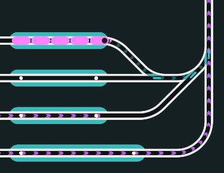

# Brickrail
Train automation software for the LEGO PoweredUp ecosystem

[Trailer on YouTube](https://www.youtube.com/watch?v=UZj41oFs1KA)

Intended to be used with LEGO PoweredUp trains and LEGO PoweredUp/Control+ hubs as stationary controllers (for motorized switches) with easy to install and uninstall [`pybricks`](https://pybricks.com/) firmware.

This project contains microphython programs running on the LEGO hardware, a python server that handles BLE communication with the devices, and a GUI running in Godot game engine that also handles the Train route and scheduling logic.
Communication between GUI and python server is done through websockets.

Trains detect their location via a Color and Distance Sensor pointed down at the track. Colored markers signal the bounds of block sections. Switches are motorized by LEGO motors attached to stationary PoweredUp hubs (Control+ 4 Port hub recommended).

Head to the [Wiki](https://github.com/Novakasa/brickrail/wiki) to learn more!

## LEGO Hub compatibility

The most well-tested hubs currently are the LEGO City hub and the LEGO Technic hub. The Mindstorms (Spike Prime) hub should also work by default, but is not tested as regularly. Unfortunately, the move hub (from LEGO Boost) is currently incompatible because of it's low memory.

## Current state

Users have reported succesfully automating their layouts, but each setup is a bit different. If you are willing to give Brickrail a go, feel free to share your issues over in [discussions](https://github.com/Novakasa/brickrail/discussions). Reports of success are also greatly appreciated, as well as any usability/quality-of-life improvement requests.

## Links

[Here](https://www.youtube.com/watch?v=cBF-G4d4vw8)'s a video of Brickrail in action with a multi-layered layout.

Head to the [Wiki](https://github.com/Novakasa/brickrail/wiki) to learn more about how to run Brickrail with your LEGO train layout.

If you have any problems setting Brickrail up, feel free to ask about it in [discussions](https://github.com/Novakasa/brickrail/discussions).

Watch this [quick guide](https://www.youtube.com/watch?v=RM7PIAkWQQ4) for a minimal setup of PoweredUp devices in the Brickrail GUI!
